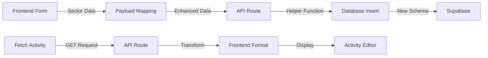

# AIMS Sector Allocation Fix Summary

## 🛑 The Problem

The sector allocation save was failing with the error:
> "Failed to update sectors: Could not find the 'category' column of 'activity_sectors' in the schema cache"

### Root Cause Analysis

1. **Schema Mismatch**: The database table `activity_sectors` had a simple `category` TEXT field, but the system needed to support full OECD DAC sector tracking with:
   - Sector categories (3-digit codes, e.g., "112" for Basic Education)
   - Sub-sectors (5-digit codes, e.g., "11220" for Primary Education)
   - Independent percentage allocations for each level

2. **Data Structure Misalignment**: The frontend was sending basic sector data, but the backend expected enhanced fields that didn't exist in the schema.

## ✅ The Solution

### 1. Database Schema Update (`sql/update_activity_sectors_schema.sql`)

Updated the `activity_sectors` table to include:
- `sector_category_code` (3-digit)
- `sector_category_name`
- `category_percentage`
- `sector_code` (5-digit)
- `sector_name`
- `sector_percentage`

```sql
CREATE TABLE public.activity_sectors (
  id UUID PRIMARY KEY DEFAULT gen_random_uuid(),
  activity_id UUID NOT NULL REFERENCES public.activities(id) ON DELETE CASCADE,
  
  -- Category fields (3-digit codes)
  sector_category_code TEXT NOT NULL,
  sector_category_name TEXT NOT NULL,
  category_percentage NUMERIC(5,2),
  
  -- Sector fields (5-digit codes)
  sector_code TEXT NOT NULL,
  sector_name TEXT NOT NULL,
  sector_percentage NUMERIC(5,2),
  
  type TEXT DEFAULT 'secondary',
  created_at TIMESTAMP WITH TIME ZONE DEFAULT CURRENT_TIMESTAMP,
  updated_at TIMESTAMP WITH TIME ZONE DEFAULT CURRENT_TIMESTAMP
);
```

### 2. Backend Improvements

#### New Utility: `src/lib/dac-sector-utils.ts`
- Extracts category information from sector codes
- Derives category names from the DAC sectors data
- Provides clean sector name formatting

#### Enhanced Helper: `src/lib/activity-sectors-helper.ts`
- Updated `upsertActivitySectors()` to handle new schema fields
- Automatically derives category information from sector codes
- Improved error logging for debugging

#### API Route Updates
- `src/app/api/activities/route.ts` - Updated sector transformations in GET and POST
- `src/app/api/activities/[id]/route.ts` - Updated individual activity fetch

### 3. Frontend Updates

#### Activity Form (`src/app/activities/new/page.tsx`)
- Enhanced payload construction to include category fields
- Maps sectors with derived category information
- Ensures backward compatibility

### 4. Data Flow



## 🔧 Implementation Steps

1. **Apply Schema Update**
   - Go to Supabase SQL Editor
   - Run the migration script from `sql/update_activity_sectors_schema.sql`

2. **Verify Implementation**
   - Run: `./test-sector-fix.sh`
   - All checks should pass ✅

3. **Test the Fix**
   - Start dev server: `npm run dev`
   - Create/edit an activity
   - Add sectors with percentages
   - Save and reload
   - Sectors should persist correctly

## 📊 What Changed

### Before
```javascript
// Simple structure
{
  code: "11220",
  name: "Primary education",
  percentage: 50,
  category: "Basic Education" // Single text field
}
```

### After
```javascript
// Enhanced structure
{
  code: "11220",
  name: "Primary education",
  percentage: 50,
  categoryCode: "112",
  categoryName: "Basic Education",
  categoryPercentage: 50,
  type: "secondary"
}
```

## 🎯 Benefits

1. **Full DAC Compliance**: Supports both 3-digit categories and 5-digit sectors
2. **Flexible Allocations**: Independent percentages at category and sector levels
3. **Data Integrity**: Proper schema with constraints and validations
4. **Future-Proof**: Ready for advanced sector reporting and analysis
5. **Better Error Handling**: Enhanced logging for debugging issues

## 🧪 Test Scenarios

### Basic Test
1. Add sector: 11220 – Primary education (50%)
2. Add sector: 11230 – Basic life skills for adults (50%)
3. Save activity
4. Reload page
5. Both sectors should appear with correct percentages

### Category Test
1. Add multiple sectors from same category (e.g., 112)
2. Verify category percentage calculations
3. Test validation for 100% requirement

## 🚨 Troubleshooting

If sectors still don't save:
1. Verify schema was updated in Supabase
2. Check browser console for errors
3. Look at Network tab for API responses
4. Ensure dev server was restarted after changes

## 📝 Notes

- The fix maintains backward compatibility
- Existing sectors are migrated with derived category data
- Category names are automatically determined from DAC sectors data
- The system gracefully handles missing category information 